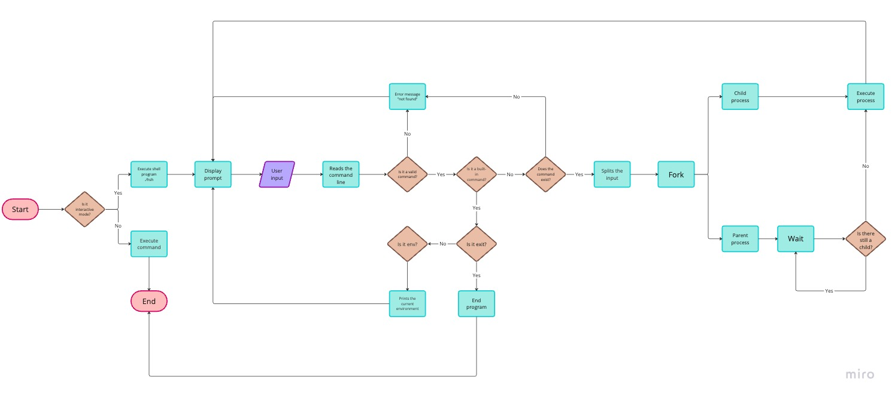

<h1 align="center"> Simple Shell </h1>
<div align="center"> :turtle: </div>

---

## About the project

This is a custom shell implementation designed to work similarly to the Thompson shell `sh`. The Thompson shell was the first Unix shell, written by Ken Thompson and is a simple UNIX command interpreter, not designed for scripting. Outputs and error messages follow the same format as the Thompson shell, except error messages print the name of the program equivalent to the inputted command.

## Table of Contents
<details>
	<summary>Table of Contents</summary>
	<ul>
	<li>
	<a href="#requirements">Requirements</a>
	</li>
	<li>
	<a href="#respository-contents">Repository Contents</a>
	</li>
	<li>
	<a href="#features">Features</a>
	</li>
	<li>
	<a href="#getting-started">Getting Started</a>
			<ul>
			<li><a href="#installation">Installation</a></li>
			<li><a href="#manual-page">Manual Page</a></li>
			</ul>
	</li>
	<li>
	<a href="#usage">Usage</a>
			<ul>
			<li><a href="#flowchart">Flowchart</a></li>
			<li><a href="#interactive-mode">Interactive Mode</a></li>
			<li><a href="#non-interactive-mode">Non-interactive Mode</a></li>
			</ul>
	</li>
	<li>
	<a href="#authors">Authors</a>
	</li>
	</ul>
</details>

## Requirements
<ul>
<li>Ubuntu 20.04 LTS</li>
	<ul>
<li><a href="https://ubuntu.com/tutorials/install-ubuntu-on-wsl2-on-windows-11-with-gui-support#1-overview">Windows 10 or 11</a></li>
<li><a href="https://ubuntu.com/download/desktop">Mac</a></li>
	</ul>
<li>Follows the <a href="https://github.com/alx-tools/Betty/wiki">betty</a> linter <a href="https://github.com/hs-hq/Betty/blob/main/betty-style.pl">style</a> and <a href="https://github.com/hs-hq/Betty/blob/main/betty-doc.pl">documentation</a></li>
<li>No more than 5 functions per file</li>
</ul>

## Repository Contents

| **File** | **Description** |
|----------|-----------------|
|`main.h`  | A header file containing the prototypes and the global variable `environ|
|`shell.c` | A C program that contains the main function |
|`find_path.c` | A C program that contains the functions `_getenv` and `find_executable_in_path` |
|

## Features

- Includes built-in commands `exit` and `env`
	- `exit` closes the shell
	- `env` prints the environment
- Allows for commands to be executed with the `$PATH` environment variable
- Supports both interactive and non-interactive mode
- Basic error handling

## Getting Started

To get a local copy up and running on your own machine, follow these simple steps:

### Installation

- Clone this repository

```
git clone https://github.com/aliciastudies/holbertonschool-simple_shell
```

- Compile using the below:

```
gcc -Wall -Werror -Wextra -pedantic -std=gnu89 *.c -o hsh
```
### Manual page

Call the manual to read how the `simple shell` works:

```
man ./man_simple_shell
```

## Usage

### Flowchart



**Introduction**:
This flowchart illustrates the steps involved in the simple shell, it outlines the steps used to determine if it's in interactive or non-interactive mode, if it's a valid command, built-in commands and executing the processes.

**Step One**:
This step determines if the simple shell is opened in the interactive mode, or if the processes are executed in the non-interactive mode. If it's in the non-interactive mode, execute the process. The shell is not opened in this initial step so it ends automatically. If it's in the interactive mode the simple shell can be opened using `./hsh`, and continue to *Step Two*.

**Step Two**:
This step displays the prompt `$`. The user can input commands here and run them by pressing `ENTER`. The simple shell will then read the command entered and determine if it's a valid command. If it's not a valid command, the simple shell will have an error message stating the command is `not found` and return to the display prompt `$`. If it is a valid command, continue to *Step Three*.

**Step Three**:
This step determines if the user's inputted command is a built-in command (`exit` or `env`) or not. If it's a built-in command, continue to *Step Four*. If it's not a built-in command, continue to *Step Five*.

**Step Four**:
This step determines which built-in command should run. If the user has inputted `exit` it will close the simple shell. If the user has inputted `env` it will print the environment in the standard output, it then returns to *Step Two*. 

**Step Five**:
This step determines if the user inputted command exists or not. If the command does not exist, the error message `not found` is displayed, and returns to *Step Two*. If the command exists, the input is split into tokens, forked into a parent process and child processes. The parent process waits for the child process to complete Continue to *Step Six*.

**Step Six**:
This step determines if the child process has completed or not. If the child process has not yet completed, the parent process continues to wait until it has. Once the child process has terminated, the processes is executed and displays in the standard output. Return to *Step Two*.


### Interactive mode
To open the simple shell in the interactive mode type the below:

```
./hsh

```
This will open the simple shell with a prompt `$` and allow the user to input commands. Example:

```
./hsh

$ _enter-your-command-here_

```
Commands can then be entered after the `$` and run, if it is a known command, it will execute, otherwise, an error message will appear.

To close the simple shell:

```
$ exit

```

**Output Examples**

| **User input** | **Expected output**|
|------------|-----------------|
|`/bin/ls` | Lists the contents of the current directory e.g. ``` hsh main.c shell.c ``` |
|`ls` | Lists the contents of the current directory e.g. ``` hsh main.c shell.c ``` |
|`ls -l /tmp`| <pre>-rw-r--r-- 1 root  root  2519 Jun 15 17:44 32 <br>|


### Non-interactive mode

The simple shell does not need to be opened. Commands can be piped into the simple shell executable using `echo`. For example, to run `/bin/ls` in the simple shell in the non-interactive mode, use the below:

```
echo "/bin/ls" | ./hsh

```
Once the process has been executed, there is no need to `exit` as the simple shell does not open in the non-interactive mode.

**Output Examples**

| **User input** | **Expected output**|
|------------|-----------------|
|`echo "/bin/ls" | ./hsh` | Lists the contents of the current directory e.g. ``` hsh main.c shell.c ``` |
|`echo "ls" | ./hsh` | Lists the contents of the current directory e.g. ``` hsh main.c shell.c ``` |
|`echo "ls -l /tmp" | ./hsh`| <pre>-rw-r--r-- 1 root  root  2519 Jun 15 17:44 32 <br>|


## Authors
- [Alicia Tan](https://github.com/aliciastudies)
- [Chelsey Chia](https://github.com/chelseyqc)
- [Jessica Mo](https://github.com/jess6718)
